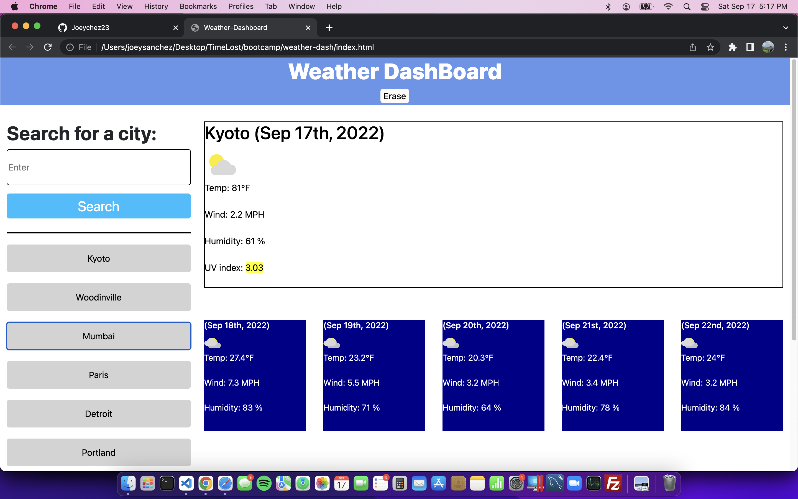
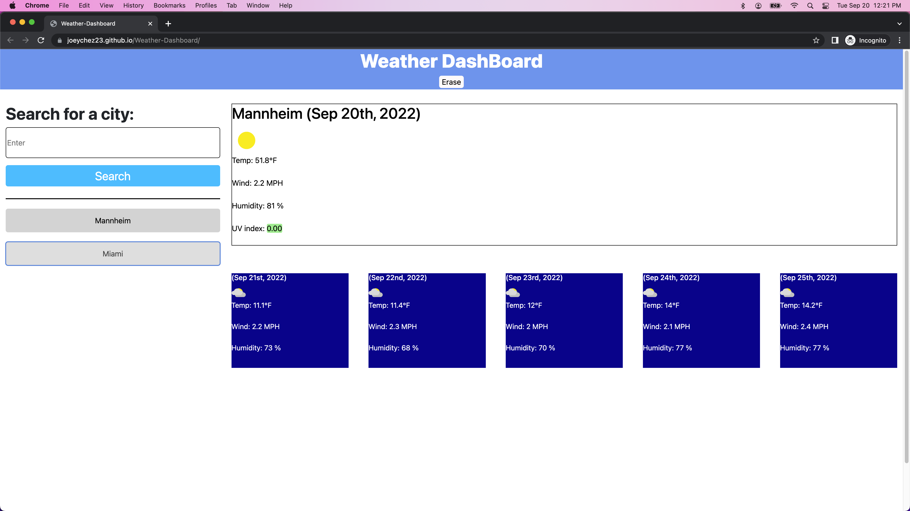
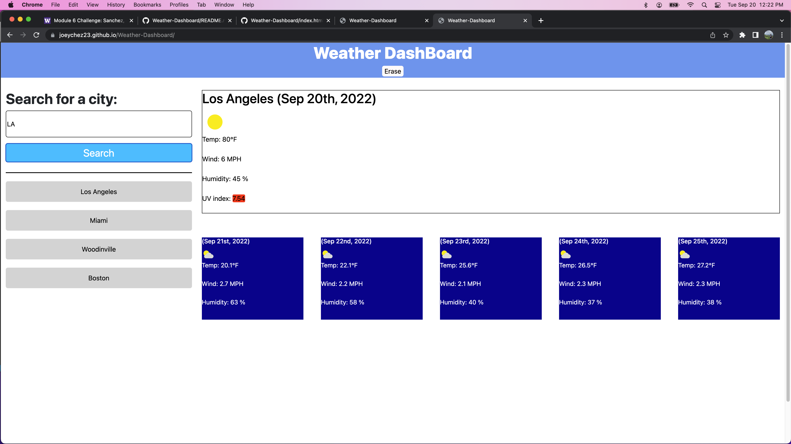

# Weather Dashboard

##Description

This site open with a single page path, The site contain default values where data will be place, once the user searches a city the following data boxes will be filled with values from the https://www.weatherbit.io/api. The site will then store the last 10 user searched values as buttons and with every button press the most recent search will be at the top of the contaner.
NOTE! This API can only hold 500 calls
NOTE! Los Angles needs LA in the searchbox
NOTE! Reapeating city values with default to the most well-known/populated city

## Output

Images of the site are shown below but the site contains working links, transitions, proper sizing, along with meeting all the requirement needed for completion of the project.

Pictures of the site will be provided bellow:

## Pages

https://joeychez23.github.io/JS-quiz-4/

## Repo

https://github.com/Joeychez23/JS-quiz-4
